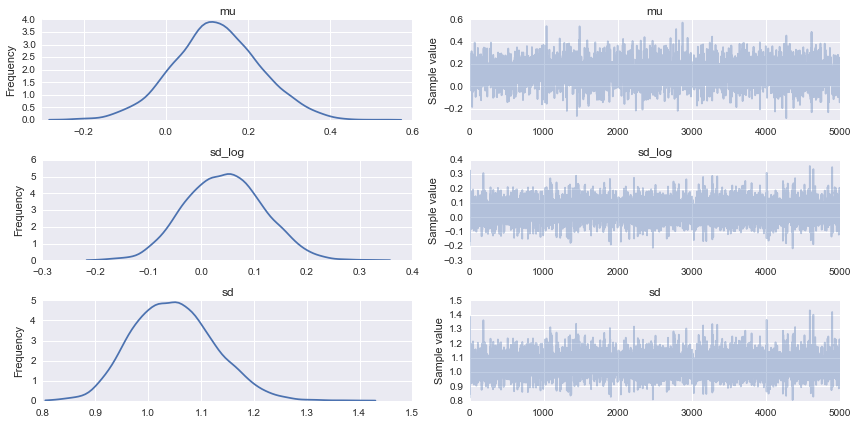
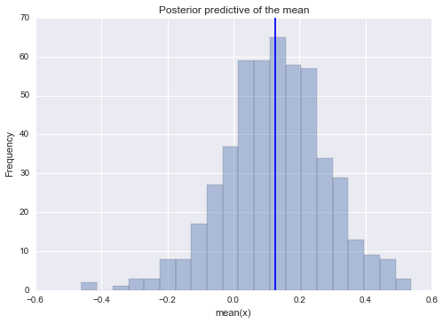
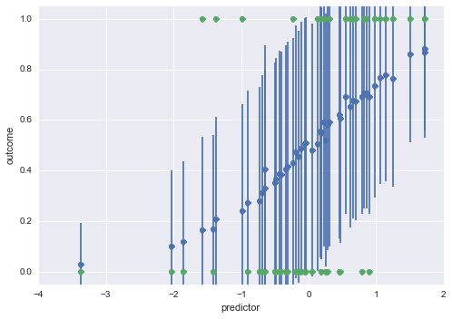

# Posterior Predictive Checks in PyMC3

PPCs are a great way to validate a model. The idea is to generate data sets from the model using parameter settings from draws from the posterior.

`PyMC3` has random number support thanks to [Mark Wibrow](https://github.com/mwibrow) as implemented in [PR784](https://github.com/pymc-devs/pymc3/pull/784).

Here we will implement a general routine to draw samples from the observed nodes of a model.


```python
%load_ext autoreload
%autoreload 2
```


```python
%matplotlib inline
import numpy as np
import pymc3 as pm
import seaborn as sns
import matplotlib.pyplot as plt
from collections import defaultdict
```

Lets generate a very simple model:


```python
data = np.random.randn(100)

with pm.Model() as model: 
    mu = pm.Normal('mu', mu=0, sd=1, testval=0)
    sd = pm.HalfNormal('sd', sd=1)
    n = pm.Normal('n', mu=mu, sd=sd, observed=data)
    
    step = pm.NUTS()
    trace = pm.sample(5000, step)
```

     [-----------------100%-----------------] 5000 of 5000 complete in 2.5 sec

    /Users/santon/anaconda/envs/pymc3/lib/python2.7/site-packages/theano/scan_module/scan_perform_ext.py:135: RuntimeWarning: numpy.ndarray size changed, may indicate binary incompatibility
      from scan_perform.scan_perform import *


```python
pm.traceplot(trace);
```





This function will randomly draw 50 samples of parameters from the trace. Then, for each sample, it will draw 100 random numbers from a normal distribution specified by the values of `mu` and `std` in that sample.


```python
ppc = pm.sample_ppc(trace, samples=500, model=model, size=100)
```

Now, `ppc` contains 500 generated data sets (containing 100 samples each), each using a different parameter setting from the posterior:


```python
np.asarray(ppc['n']).shape
```


    (500, 100)


One common way to visualize is to look if the model can reproduce the patterns observed in the real data. For example, how close are the inferred means to the actual sample mean:


```python
ax = plt.subplot()
sns.distplot([n.mean() for n in ppc['n']], kde=False, ax=ax)
ax.axvline(data.mean())
ax.set(title='Posterior predictive of the mean', xlabel='mean(x)', ylabel='Frequency');
```





# Prediction

The same pattern can be used for prediction. Here we're building a logistic regression model. Note that since we're dealing the full posterior, we're also getting uncertainty in our predictions for free.


```python
# Use a theano shared variable to be able to exchange the data the model runs on
from theano import shared
```


```python
def invlogit(x):
    return np.exp(x) / (1 + np.exp(x))

n = 4000
n_oos = 50
coeff = 1.

predictors = np.random.normal(size=n)
# Turn predictor into a shared var so that we can change it later
predictors_shared = shared(predictors)

outcomes = np.random.binomial(1, invlogit(coeff * predictors))
```


```python
outcomes
```


    array([1, 1, 0, ..., 0, 1, 1])


```python
predictors_oos = np.random.normal(size=50)
outcomes_oos = np.random.binomial(1, invlogit(coeff * predictors_oos))
```


```python
def tinvlogit(x):
    import theano.tensor as t
    return t.exp(x) / (1 + t.exp(x))

with pm.Model() as model:
    coeff = pm.Normal('coeff', mu=0, sd=1)
    p = tinvlogit(coeff * predictors_shared)

    o = pm.Bernoulli('o', p, observed=outcomes)
    
    start = pm.find_MAP()
    step = pm.NUTS(scaling=start)
    trace = pm.sample(500, step)
```

     [-----------------100%-----------------] 500 of 500 complete in 2.9 sec


```python
# Changing values here will also change values in the model
predictors_shared.set_value(predictors_oos)
```


```python
# Simply running PPC will use the updated values and do prediction
ppc = pm.sample_ppc(trace, model=model, samples=500)
```

## Mean predicted values plus error bars to give sense of uncertainty in prediction


```python
plt.errorbar(x=predictors_oos, y=np.asarray(ppc['o']).mean(axis=0), yerr=np.asarray(ppc['o']).std(axis=0), linestyle='', marker='o')
plt.plot(predictors_oos, outcomes_oos, 'o')
plt.ylim(-.05, 1.05)
plt.xlabel('predictor')
plt.ylabel('outcome')
```


    <matplotlib.text.Text at 0x129c81890>





```python

```
